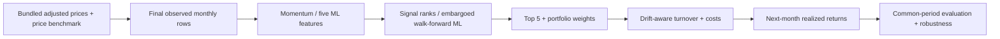
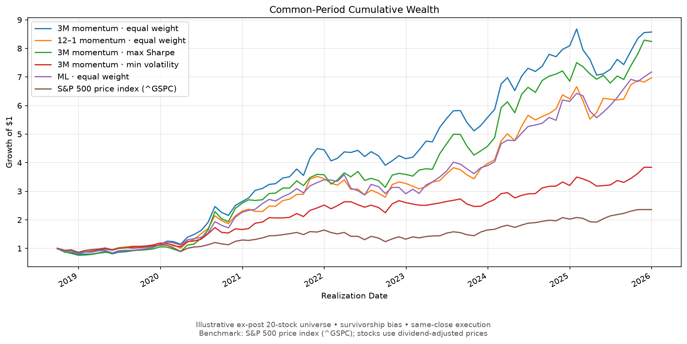
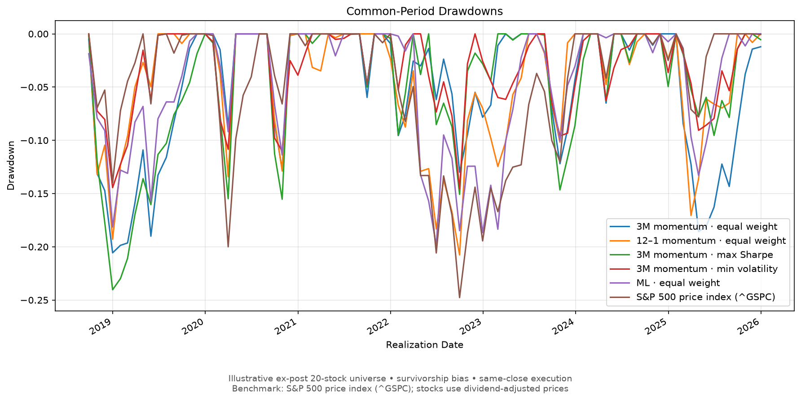
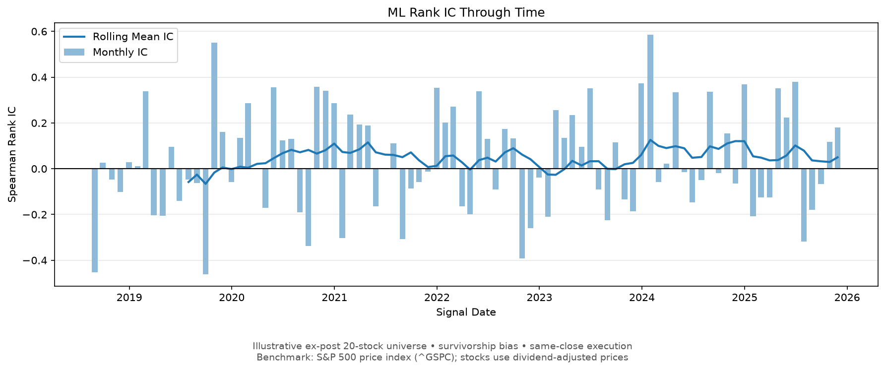
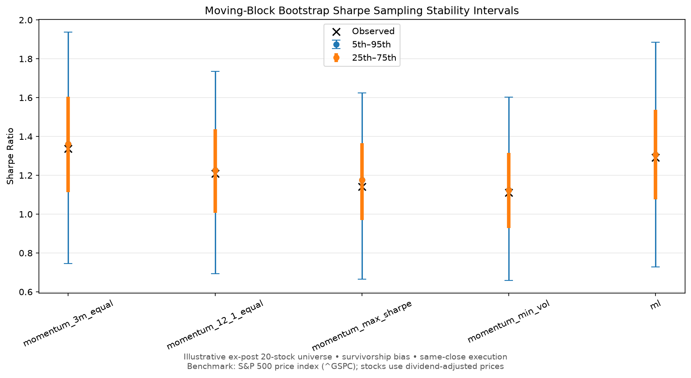
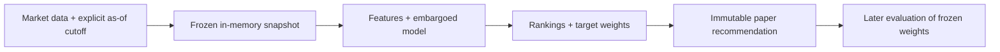

# Equity Ranking & Portfolio Research

**A Python research platform for comparing equity signals, portfolio construction,
and machine-learning rankings—with explicit timing, costs, and data limitations.**

**Research question:** how do momentum, constrained optimization, and a
walk-forward classifier behave under the same monthly portfolio protocol?
I built the data-to-portfolio pipeline, evaluation and robustness tools, and
prospective paper/replay workflow described below.

> **Historical results are illustrative research output conditional on an ex-post
> 20-stock universe—not an unbiased S&P 500 backtest.** Genuine historical
> membership, inactive securities and delisting returns are unavailable.
> The `^GSPC` price benchmark also excludes dividends included in adjusted stock
> prices. Strong sample performance is not an investment-performance claim.

[Research report](docs/RESEARCH_REPORT.md) · [Exact methodology](docs/METHODOLOGY.md) ·
[Audit](AUDIT.md) · [Reproduction](docs/REPRODUCIBILITY.md) ·
[Validation](docs/VALIDATION.md) · [Portfolio & interview guide](docs/PORTFOLIO.md)

## Highlights

- **Five comparable portfolios:** 3M/12–1 momentum, max-Sharpe/min-volatility
  optimization, and gradient-boosted ML ranking.
- **Available-label training:** expanding windows, strict target-date embargo,
  and an explicit five-feature allow-list.
- **Constrained allocation:** Top-5 selection, 40% optimizer caps, visible fallbacks.
- **Trading-aware accounting:** drifted pre-trade weights and 10 bps one-way costs.
- **Reproducibility:** deterministic replay, input/source hashes, frozen paper targets.
- **69 regression/contract tests** covering timing, leakage, portfolios and providers.

## Quick start

From the repository root, using Python 3.11 (macOS/Linux):

```bash
python -m venv venv
source venv/bin/activate
python -m pip install -r requirements.txt
export MPLBACKEND=Agg
python -m pytest -q
python comparison_main.py
```

`requirements.txt` is the unpinned dependency list. For the recorded environment,
use `requirements-lock.txt` instead; it captures tested package versions but is
not a portable, hash-verified lock. **A fresh install has not been validated.**
The bundled inputs support offline runs after dependency installation.

Start with `comparison_main.py` for the five-strategy table; then use
`research_main.py` for figures and diagnostics. Robustness and live/replay are
separate deeper workflows: see [full reproduction](docs/REPRODUCIBILITY.md).

## Research pipeline



The separate universe/provider layer supports fixed20 and current S&P 500
research, with a dated-membership contract for future PIT datasets. It fails
explicitly when requested historical membership is unavailable; it does not
turn today's constituents into a historical index.

## Strategies and portfolio rules

| Strategy | Ranking signal | Portfolio rule |
|---|---|---|
| 3M momentum | Three-month price return | Top 5, equal weight |
| 12–1 momentum | P[t−1] / P[t−12] − 1 | Top 5, equal weight |
| Momentum max Sharpe | Same 3M ranking | Top 5, constrained maximum-Sharpe weights |
| Momentum min volatility | Same 3M ranking | Top 5, constrained minimum-variance weights |
| ML ranking | Probability of next-month benchmark outperformance | Top 5, equal weight |

Monthly, long-only portfolios; optimizer weights sum to one and are capped at
40%. Optimizers require 252 daily price observations and record equal-weight
fallbacks for insufficient/missing history or expected optimization failures.
Costs are **10 bps × one-way turnover**, measured against drifted pre-trade
weights; initial deployment has turnover one. **Same-close execution remains
an explicit optimistic assumption.**

## ML methodology and research integrity

The unchanged `HistGradientBoostingClassifier` uses 1M/3M/6M momentum,
three-month volatility and drawdown; settings are 200 iterations, learning rate
0.05, maximum depth 3, seed 42. It ranks probabilities, not expected returns.

- **Available labels only:** expanding-window training requires 36 labeled
  feature months and `target_date < prediction_date`. Labels ending at the
  prediction cutoff are embargoed.
- **Explicit inputs:** only five named features enter the model; targets and
  future/evaluation returns are excluded.
- **Ex-ante selection:** next-month return availability cannot replace a
  selected stock. Missing selected outcomes fail explicitly.
- **Aligned accounting:** signal and realization dates are separate; comparison
  uses identical realization months, drift-aware turnover, and visible fallbacks.
- **Prospective isolation:** cutoff snapshots, deterministic input hashes,
  immutable paper recommendations, and replay checks preserve decision history.

## Illustrative historical results

All five strategies, 88 common monthly realizations: **2018-09-28–2025-12-31**.
Net of modeled costs; first year partial. Ex-post universe and benchmark
mismatch apply to every row. No strategy is presented as superior.

| Portfolio | CAGR | Volatility | Sharpe | Sortino | Max drawdown | Tracking error | IR |
|---|---:|---:|---:|---:|---:|---:|---:|
| 3M equal | 34.04% | 24.23% | 1.338 | 2.879 | −20.57% | 17.33% | 1.110 |
| 12–1 equal | 30.32% | 24.49% | 1.209 | 2.583 | −20.76% | 15.25% | 1.077 |
| 3M max Sharpe | 33.33% | 28.79% | 1.141 | 2.815 | −24.03% | 21.75% | 0.904 |
| 3M min volatility | 20.13% | 18.06% | 1.110 | 2.242 | −14.56% | 13.03% | 0.527 |
| ML equal | 30.83% | 22.99% | 1.291 | 2.735 | −19.86% | 13.24% | 1.246 |
| S&P 500 price index | 12.42% | 16.93% | 0.779 | 1.205 | −24.77% | N/A | N/A |

[Complete metrics](reports/common_period_performance.csv) ·
[Yearly returns](reports/common_period_yearly_returns.csv) ·
[Monthly turnover](reports/common_period_turnover.csv) · [Output guide](reports/README.md)

## Key research outputs





<details>
<summary>Ranking quality and robustness figures</summary>





[Rolling Sharpe](reports/rolling_sharpe.png) ·
[Yearly returns](reports/annual_return_comparison.png) ·
[Turnover](reports/common_period_turnover.png) ·
[Cost sensitivity](reports/cost_sensitivity_sharpe.png)

</details>

## Robustness analysis

Leave-one-out reruns test dependence on individual stocks; fixed subperiods
and rolling 24-month windows test temporal consistency. Cost sensitivity and
a one-month execution delay challenge implementation assumptions. Paired
moving-block bootstrap measures sampling variability; contributor concentration
and extreme-month removal expose dependence on a few outcomes. Optimizer
input/weight diagnostics and ML Rank IC/decay examine stability.

These tests neither repair survivorship bias nor choose an official strategy.
Ex-post contribution subtraction and best-month removal are non-investable
counterfactuals. The [scorecard](reports/robustness_scorecard.csv) contains separate
diagnostics, **no synthetic robustness rating**.

## Data limitations

| Limitation | Consequence |
|---|---|
| Ex-post survivors | Twenty currently successful names cannot represent historical investable membership. |
| Missing delistings | Inactive-security history and delisting returns are absent. |
| Benchmark mismatch | `^GSPC` price returns omit distributions present in stock adjusted prices. |
| Revisable vendor data | Yahoo-style adjustments are not institutional point-in-time observations. |
| Execution and liquidity | Same-close fills and constant costs omit latency, spreads, impact and capacity. |

Provider contracts can accept better data later. Architecture readiness does
not resolve these limitations, and no historical membership was fabricated.

## Prospective research



Legacy live runs resolve the latest available bundled observation; replay
excludes later market rows before forming features or training. Saved hashes
identify inputs; reproducing legacy runs still requires preserving the input
files. Institutional acquisition additionally versions raw and normalized data.
Current S&P scoring is separate from historical performance.

**Research recommendation ≠ trade execution ≠ expected profit.**

## Reproduction and deeper review

[Reproduction guide](docs/REPRODUCIBILITY.md) covers every entrypoint, frozen
inputs, Phase 1 → Phase 2 dependencies, and prospective research. `main.py` and
`ml_main.py` are standalone baseline/ML reports; `live_main.py` updates the
research paper ledger by default. [Validation](docs/VALIDATION.md) records
actual executions, warnings and unchanged CSV checks. Historical run manifests
preserve settings, model parameters, environment versions and input/source/output
hashes; preserve reports with their manifest when sharing a result.

## Project map

```text
├── *_main.py / main.py        # historical, live and institutional entrypoints
├── src/
│   ├── config.py             # official research settings
│   ├── data/ + universe/     # loaders, providers, membership and cache versions
│   ├── features/ + models/   # signals and embargoed ML
│   ├── portfolio/ + backtest/ # allocation, realized returns and trading costs
│   └── evaluation/ + live/   # diagnostics, provenance and paper research
├── tests/                    # regression and contract tests
├── docs/                     # methodology, report, reproduction and validation
├── data/raw/                 # frozen small reproduction inputs
├── reports/                  # representative CSVs/figures; ignored repeated runs
└── notebooks/                # explicitly superseded exploratory history
```

Optional next work: genuine PIT/total-return data, next-session execution with
suitable prices, liquidity/capacity analysis, and formal factor attribution.
