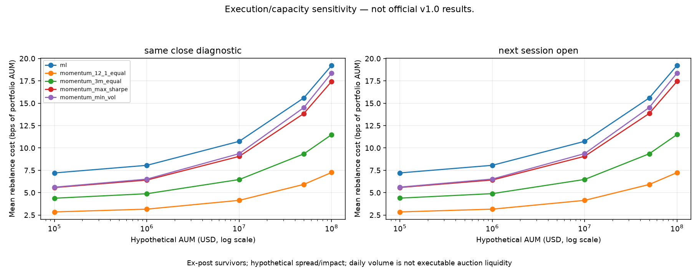

# v1.1 Execution & Capacity research

**Execution/capacity sensitivity — not official v1.0 results.**

Question: how sensitive are the five existing portfolios to assumed execution
costs, a next-session price, and larger hypothetical capital? This extension
reuses v1.0 signals, rankings and target weights without tuning or replacement.
The official 10 bps × one-way turnover backtest and its CSVs remain unchanged.

## Run and inspect

Activate the existing project environment and run from the repository root:

```bash
export MPLBACKEND=Agg
python execution_capacity_main.py
```

The default requires exactly one existing Parquet in
`data/institutional/normalized/`. No network request is made. A missing or
ambiguous cache raises `LIQUIDITY_DATA_UNAVAILABLE_OR_AMBIGUOUS`; nothing is
fabricated from the bundled adjusted closes. For an explicitly chosen provider
panel, or alternative hypotheses:

```bash
python execution_capacity_main.py --liquidity-panel /path/to/normalized.parquet --adv-window 60 --aum 100000 1000000 10000000 50000000 100000000 --spread-slippage-bps 5 --impact-bps 10 --reference-participation 0.01 --participation-limits 0.01 0.05 0.10
```

The latter is a parameter/schema example, not a claim that the placeholder file
exists. The normalized schema requires `date`, `canonical_ticker`, `raw_close`
and `volume`. Existing institutional providers already expose these fields.
The downloaded cache is deliberately not tracked: a fresh clone without suitable
liquidity data cannot reproduce these diagnostics from adjusted OHLC alone.

## Data and timing

The bundled frozen prices contain dividend-adjusted daily Open/Close and share
volume. They lack unadjusted closes. The local normalized Yahoo research cache
contains vendor raw closes and share volume from 2021-07-23 onward. No prices
or volumes are inferred or backfilled. The extension aligns that cache to the
frozen 20-stock trading-session calendar; dates beyond the frozen data endpoint
are inaccessible to the calculations.

Dollar volume is the proxy `vendor raw_close × share_volume`. This is not an
observed intraday traded-dollar sum. ADV20 (or ADV60) is its arithmetic mean
over the full prior 20 (or 60) sessions. **The signal day's volume is excluded**,
so ADV is available before either diagnostic execution mode. Missing, zero,
negative or nonfinite volume/price invalidates the window. The input manifest
records the later liquidity-vendor vintage separately from frozen adjusted
prices; this mixed-vintage study is not point-in-time execution research.

The paired sample begins when a complete ADV window exists for all 20 names.
Thereafter, invalid ADV for any nonzero trade fails; it never silently removes
a security or rebalance. A terminal interval without the next market session
is explicitly excluded. Both timing modes use the same signals and their
following monthly valuation boundaries. `excluded_periods.csv` records the
sample restriction. Missing prices for a held name fail instead of selecting a
later convenient ticker-specific observation.

## Trade dollars and capital

Default AUM scenarios are **$100k, $1m, $10m, $50m and $100m**. These are
hypothetical sensitivities, not recommendations. At each execution:

- `position_dollars = AUM × target_weight`.
- `trade_dollars = AUM × (target_weight − drifted_pretrade_weight)`.
- `trade_as_pct_ADV = abs(trade_dollars) / ADV_dollars`.

Old holdings drift using the price relatives between executions; exits are
included alongside entries and reweights. Each timing mode starts from cash at
the paired sample's beginning, with initial turnover one. Subsequent one-way
turnover is half the L1 weight change. AUM is held constant at each rebalance,
not compounded with the strategy. This isolates capital scaling and is not a
self-financing fund simulation; fees do not alter the next period's weight drift.
No shares are inferred from adjusted prices for participation calculations.

**Why turnover is insufficient:** identical weight changes can correspond to
very different trade dollars at different AUM, and identical dollars can be a
small or large share of available daily volume. ADV normalizes trade size, but
does not measure the actual order book or available auction liquidity.

## Hypothetical execution costs

Per traded dollar, the default assumed cost is:

`unit_cost_bps = 5 + 10 × sqrt(trade_as_pct_ADV / 0.01)`.

The 5 bps component represents a hypothetical spread/slippage allowance. Spread
is the bid/ask gap; slippage is the difference between a reference price and an
achievable fill. The impact term represents an assumed increase in cost with
relative trade size. All three parameters are configurable and nonnegative;
none is fitted to returns or empirical execution quotes. There are no bid/ask
observations in these inputs.

`period_cost = sum(abs(trade_dollars) × unit_cost_bps / 10000) / AUM`.

The cost applies to both buys and sells and is deducted once from gross return.
**It replaces the cost only within the diagnostic calculation; it is not added
to the official 10 bps model.** Each row also reports a separate constant-cost
reference `gross_return − 0.001 × one_way_turnover`. Per-traded-dollar costs
and the one-way-turnover convention differ: even 5 bps on each traded dollar
is not generally a 5 bps portfolio deduction. Costs that exhaust portfolio
capital raise an error rather than being clipped.

The square-root function is an illustrative monotone assumption. Empirical
research also reports departures from simple square-root scaling; it does not
justify these coefficients. See [Zarinelli et al., *Beyond the square root*](https://arxiv.org/abs/1412.2152).

## Participation and diagnostic capacity

Reported median, 95th percentile and maximum participation use **nonzero
security trades**, equally weighted across the sample. This sample
uses changes greater than `1e-12` of portfolio weight; smaller numerical
residuals are zeroed only in diagnostic trade dollars and costs. Original
targets and the v1.0 accounting remain unchanged. Threshold exceedance
rates count trades strictly above 1%, 5%, or 10% ADV. CSV fields containing
`pct` are fractions (0.01 means 1%), not numbers already multiplied by 100.

For configurable limit L, the conservative sample ceiling is:

`min_over_trades(L × ADV_dollars / abs(trade_weight))`.

The report preserves the binding ticker/date. It describes the capital at which
the largest historical relative trade meets a chosen daily-volume constraint;
it is **not a true fund-capacity estimate**. No composite score or strategy
ranking is created. `capacity_flag` only indicates whether any trade exceeds
the largest tested participation limit. Being within that limit is not an
execution assurance. `annualized_turnover = 12 × mean(monthly turnover)`
includes the sample's initial deployment. `estimated_cost_bps` is the mean
rebalance cost in bps of portfolio AUM, not bps per traded dollar.

## Next-session diagnostic

The mode `next_session_open` applies each unchanged month-end target at the
next available market-session adjusted open. It values that portfolio through
the adjusted open following the next month-end signal. Features and model
training still stop at the original signal cutoff; neither is recomputed using
the next day's data. Orders are formed before inspecting holding-period returns.
Trading quantities use idealized weights valued at that observed open.

This is a timing-safe **price-reference sensitivity**, not a claim that an
opening-auction order could be sized and filled exactly at those prices.
There are no quotes, auction prints, intraday volumes or order/fill records.
Dividend-adjusted opens are vendor research proxies, not executable fills.

The paired `same_close_diagnostic` resets to cash over the same restricted
sample. Its startup cost/state differs from the already-running v1.0 strategy
at that date, so it is not a replacement official history. The timing comparison
reports next-minus-same differences in diagnostic CAGR/Sharpe and constant-10bps
reference Sharpe. The holding intervals differ by one session; these are paired
signal comparisons, not identical-date active returns against a benchmark.

## Outputs and boundaries

All new outputs are confined to `reports/execution_capacity/`:

| File | Purpose |
|---|---|
| `execution_capacity_summary.csv` | Every strategy × timing × AUM, participation, cost, turnover and return summaries |
| `capacity_thresholds.csv` | Diagnostic AUM ceiling at each participation limit and its binding trade |
| `execution_timing_comparison.csv` | Paired next-session versus same-close differences |
| `trades.csv` | Audit ledger including signed trades, positions, ADV, participation and dollar costs |
| `periods.csv` | Gross/reference/diagnostic returns, turnover, costs, entry and valuation dates |
| `excluded_periods.csv` | Explicit early-history and terminal-data exclusions |
| `manifest.json` | Configuration, input/code/output hashes, environment, sample dates and warnings |
| Three PNG figures | AUM versus costs, maximum ADV participation and diagnostic Sharpe |

Rerunning overwrites only this separate diagnostic view. Preserve its manifest
and outputs together when comparing assumptions. Detailed ledgers are ignored
for Git; small representative summaries and figures can be reviewed normally.
The original research pipelines do not import `src.execution`.

Daily volume does not guarantee executable liquidity. Opening/closing auctions
may have different liquidity; spreads and impact vary across time and regimes;
large orders may alter the very prices used as references. The model omits
order scheduling, duration, queue priority, spread variation, financing and
market feedback. Yahoo-style data are revisable and not institutional execution
data. The ex-post universe, missing delistings/PIT membership and benchmark
mismatch remain: **v1.1 does not make the historical backtest unbiased.**

## Recorded default diagnostic findings

The available inputs support **51 paired monthly signals, 2021-08-31 through
2025-10-31**, giving 50 strategy/timing/AUM scenarios. The last same-close
valuation is 2025-11-28; its next-session counterpart is 2025-12-01. This
restricted, cash-reset sample must not be compared directly to the full v1.0
performance table.

Across the five strategies and both timing modes, mean modeled rebalance cost
ranges from **2.84–7.21 bps of AUM at $100k** to **7.24–19.23 bps at $100m**.
At $100m, maximum trade participation ranges from **3.17% to 5.97% ADV**.
The sample's 1% participation ceilings range from **$16.75m to $31.56m**;
5% ceilings range from **$83.76m to $157.78m**. These are algebraic thresholds
under fixed historical trades, not estimates of achievable fund capacity.

For example, ML at $100m has diagnostic Sharpe **0.998** with the paired
same-close reference and **1.020** with next-session opens. This is one
execution sensitivity, not evidence for choosing a strategy or tuning an
execution rule. The separate timing table retains every scenario.

[Scenario summary](../reports/execution_capacity/execution_capacity_summary.csv) ·
[Participation ceilings](../reports/execution_capacity/capacity_thresholds.csv) ·
[Timing comparison](../reports/execution_capacity/execution_timing_comparison.csv)



## Validation

The untouched baseline passed 69 tests before implementation. The final suite
passes **91 tests**, including 22 new execution/capacity cases: prior-window
ADV20/60, invalid volume, signed entry/exit trades, participation arithmetic,
capital scaling, monotone assumed costs, drift at actual execution boundaries,
next-session timing, future-outcome isolation, deterministic results, explicit
missing-data failures, contiguous holding periods, numerical trade residuals,
and frozen release hashes. Existing tests were not weakened.

The test run emitted one existing joblib warning about physical-core detection;
it fell back to logical cores. No model class, parameter, feature, ranking,
portfolio rule or official cost calculation was changed.

All six official historical entrypoints completed successfully after the
extension: `main.py`, `ml_main.py`, `comparison_main.py`, `research_main.py`,
`robustness_main.py`, and `robustness_phase2_main.py`. All **209 pre-existing
report CSVs** remained byte-for-byte identical to their pre-change hashes;
this includes the **39 tracked v1.0.0 release CSVs** independently checked by
the regression fixture. Two final diagnostic executions produced identical
bytes for all six new CSVs. Manifest source/output hashes and all three figures
were checked. Detailed local logs are under ignored `reports/validation/v11/`.
No commit or push was performed.
